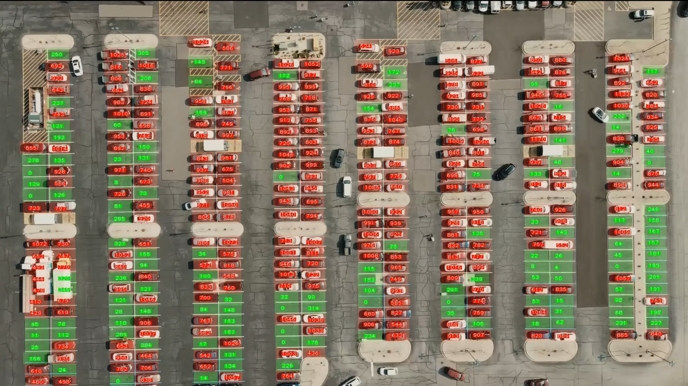

# Car Park Space Detection with OpenCV and Python

## Car Park Space Detection Using Python and OpenCV.

It was used OpenCV and Python to detect the Car Park Space, and to detect if there is any Car in that specific space.

## Preview

- Car Park Space Detectio Preview: https://www.youtube.com/watch?v=gc5Js3TiQoc

## Connect
- Linkedin: https://www.linkedin.com/in/luis-jose-mendez/
- GitHub: https://github.com/mendez-luisjose
